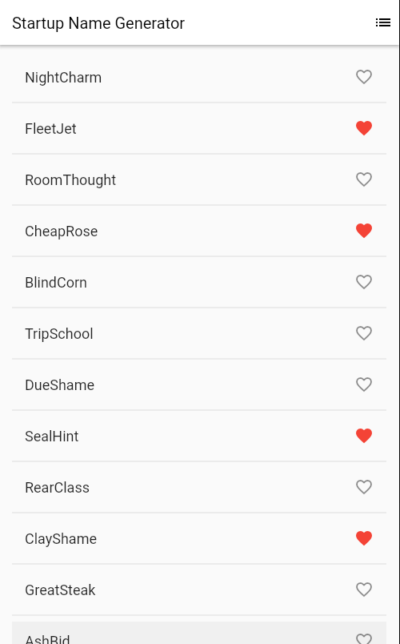
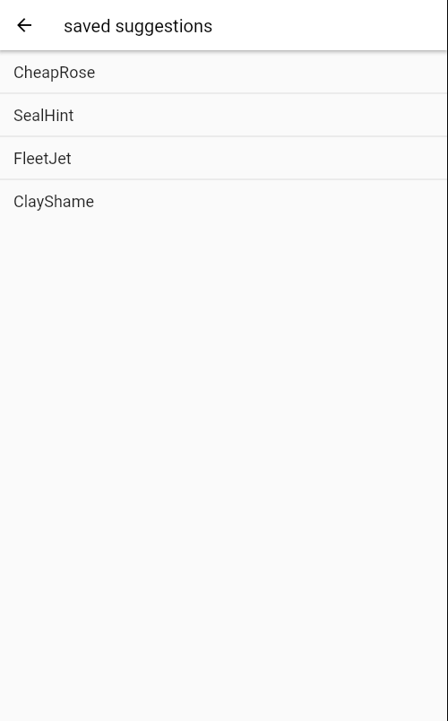

# Startup Name Generator
- The app extends StatelessWidget, which makes the app itself a widget.
- The Scaffold widget, from the Material library, provides a default app bar, a title, and a body property that holds the widget tree for the home screen.

